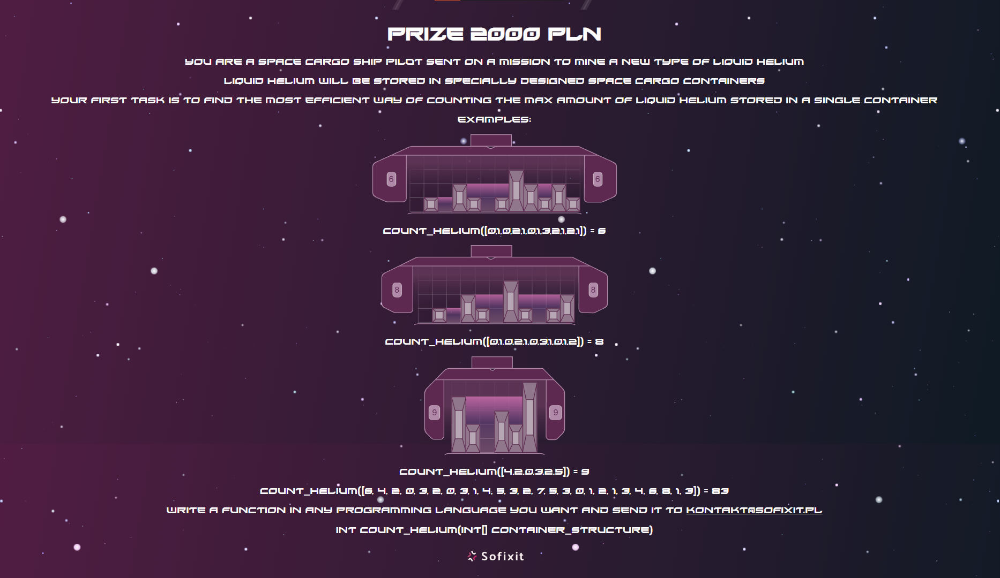

## Sofixit challenge 2022



### Created by:

- Maciej Bazela, [@Flowyh](https://github.com/Flowyh)
- Joanna Kulig, [@ajzia](https://github.com/ajzia)

### Date: 03.05.2022

## Solution:

#### First approach:

First approach is the most time-consuming of all of the three attemps. It is not very optimal so we did not consider it for too long, neither did we implement it. Nevertheless, we thought it was worth to mention since it was a part of our process of finding the best solution.

##### Algorithm goes as follows:

1. Iterate through the entire cargo unit of length **n** and find **max_height** of the block.
2. Construct a matrix **n** x **max_height** showing our cargo unit as a 'binary matrix' - ones show occupied cells and zeros mean empty spaces (or space containing liquid helium).
3. Delete all trailing zeros in each row of the matrix.
4. Count all the zeros left in the matrix.

##### Examples:

Example.1

```
[4,0,2,1,3,2,4] with capacity = 12
```

Binary matrix for the above example:

```
1000001
1000101
1010111
1011111
```

Example.2

```
[0,4,0,3,2,1,0] with capacity = 3
```

Binary matrix for the above example:

```
0100000
0101000
0101100
0101110
```

After removing trailing zeros:

```
1
101
1011
10111
```

##### Algorithm time complexity:

- 1st step:
  - Iterating through the cargo blocks
  - O(n)
- 2nd step:
  - Constructing the matrix
  - O(n \* max_height)
- 3rd step:
  - Iterating through the matrix to get rid of trailing zeros
  - Worst case - (no trailing zeros) O(n \* max_height)
- 4th step:
  - Iterating through the matrix to count all the zeros left
  - Worst case - O((n - 2) \* max_height)

Summed time complexity:

```
O(n) + O(n * max_height) + O(n * max_height) + O((n - 2) * max_height) = O(n * max_height)
```

##### Algorithm space complexity:

Allocated matrix:

```
O(n * max_height)
```

#### Second approach:

Our second approach was found immediately after figuring out the first one. It uses the same logic but instead of finding the maximum height and initializing the non-truncated matrix in seperate steps, we have managed to do it at once. That gave us an already left-truncated matrix.

##### Algorithm goes as follows:

0. **max_height** := 0; **matrix** := [ ]
1. Iterate through the entire cargo unit of length **n** and for each block do the following:
   - For **i** from 1 to **max_height**
     - If block's height is greater of equal than **i**, append 1 to **i**-th matrix row
     - Else, append 0 to **i**-th matrix row
   - If block's height is greater than current **max_height**
     - **max_height** := block's height
     - Add new row in the matrix with one element - 1
2. Delete all right-trailing zeros in each row of the matrix.
3. Count all the zeros left in the matrix.

##### Examples:

Example.1

```
[4,0,2,1,3,2,4] with capacity = 12
```

Binary matrix for the above example:

```
1000001
1000101
1010111
1011111
```

Example.2

```
[0,4,0,3,2,1,0] with capacity = 3
```

Binary matrix for the above example:

```
100000
101000
101100
101110
```

After removing right-trailing zeros:

```
1
101
1011
10111
```

##### Algorithm time complexity:

- 1st step:
  - Iterating through cargo blocks - O(n)
    - appending data to the matrix - worst case O(max_height)
    - creating new rows in the matrix - worst case O(max_height)
- 2nd step:
  - Iterating through the matrix to get rid of right-trailing zeros
  - Worst case: (no right-trailing zeros) O(n \* max_height)
- 3rd step:
  - Iterating through the matrix to count all the zeros left
  - Worst case: O((n - 2) \* max_height)

Summed time complexity:

```
O(n * max_height) + O(n * max_height) + O((n - 2) * max_height) = O(n * max_height)
```

##### Algorithm space complexity:

Allocated matrix:

```
O(n * max_height)
```

#### Third approach:

Our third (and best) approach was found recently (_today_). It omits initializing **n** x **max_height** matrix and requires only one loop through the cargo blocks array. The key idea is to keep track of temporary capacity counters for each row and add them to overall capacity only when certain conditions are met.

##### Algorithm goes as follows:

0. **left_wall** := 0; **zeros_counter** := []; **capacity** := 0
1. For each block in cargo do the following:
   - If length of **zeros_counter** is less than block's height:
     - **left_wall** := block's height
     - Until length of **zeros_counter** != block
       - Append 0 to **zeros_counter**
   - For **i** from 1 to **left_wall**
     - If **i** is greater than block, increment **zeros_counter[i]**
       - it means that **i**-th level at current block's position is empty, which we can potentially use as a helium storage
     - Else, **capacity** += **zeros_counter[i]**, **zeros_counter[i]** := 0
       - it means that we have found a right wall, so the counter contains number of cells, which we can fill with liquid helium

##### Example.2 step by step:

```
[0,4,0,3,2,1,0] with capacity = 3
```

| i   | i-th block | left_wall | zeros_counter | capacity |
| --- | ---------- | --------- | ------------- | -------- |
| 1   | 0          | 0         | []            | 0        |
| 2   | 4          | 4         | [0, 0, 0, 0]  | 0        |
| 3   | 0          | 4         | [1, 1, 1, 1]  | 0        |
| 4   | 3          | 4         | [0,0,0,2]     | 3        |
| 5   | 2          | 4         | [0,0,1,3]     | 3        |
| 6   | 1          | 4         | [0,1,2,4]     | 3        |
| 7   | 0          | 4         | [1,2,3,5]     | 3        |

What's more, the resulting zeros_counter array contains number of right-trailing zeros in bit representation of each cargo level.

```
100000 -> 5
101000 -> 3
101100 -> 2
101110 -> 1
```

##### Algorithm time complexity:

- 1st step:
  - Iterating through cargo blocks - O(n)
    - Appending 0 to zeros_counter - worst case O(max_height)
    - Iterating from 1 to max_height - worst case O(max_height)

Summed time complexity:

```
O(n * max_height)
```

##### Algorithm space complexity:

Allocated zeros_counter array:

```
O(max_height)
```
